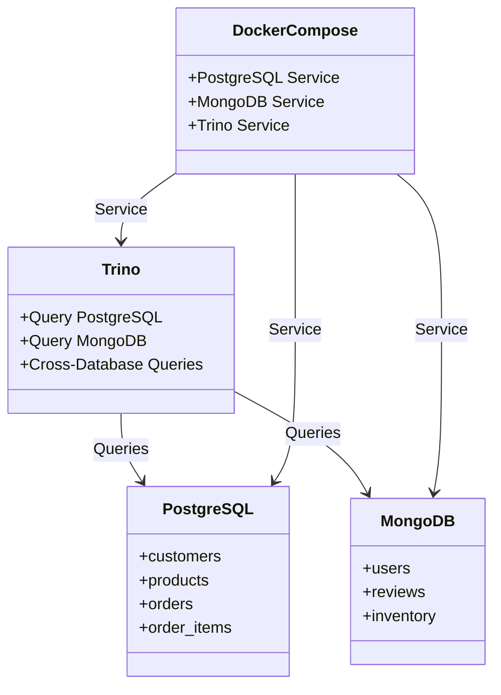

# trino-playground

## Description

This project is a data platform playground that demonstrates the integration of Trino with PostgreSQL and MongoDB. It showcases how to query data from multiple sources and perform cross-database queries using Trino.

## Features

- **Data Initialization**: Scripts to populate PostgreSQL and MongoDB with sample data.
- **Trino Configuration**: Pre-configured Trino setup for querying PostgreSQL and MongoDB.
- **Cross-Database Queries**: Example queries that combine data from PostgreSQL and MongoDB.
- **Dockerized Environment**: Easy setup using Docker Compose.

## Demo
Just a brief demo that enable Trino to query across multiple database, in this exmaple using Postgres and MongoDB.
```
$ python trino_query_test.py 

PostgreSQL Data:
[1, 'John Doe', 'john@example.com', 'USA', datetime.date(2024, 1, 15)]
[2, 'Jane Smith', 'jane@example.com', 'Canada', datetime.date(2024, 2, 20)]
[3, 'Bob Johnson', 'bob@example.com', 'UK', datetime.date(2024, 3, 5)]
[4, 'Maria Garcia', 'maria@example.com', 'Spain', datetime.date(2024, 1, 28)]
[5, 'Ahmed Hassan', 'ahmed@example.com', 'Egypt', datetime.date(2024, 2, 14)]
[6, 'Li Wei', 'li@example.com', 'China', datetime.date(2024, 3, 10)]
[7, 'Anna Kowalski', 'anna@example.com', 'Poland', datetime.date(2024, 1, 5)]

MongoDB Data:
['Laptop', 1200, 'Electronics', True]
['Headphones', 100, 'Electronics', True]
['Coffee Maker', 80, 'Kitchen', False]

Cross-Database Query:
['John Doe', 'Laptop', 1200]
['John Doe', 'Headphones', 100]
['John Doe', 'Coffee Maker', 80]
```

## Getting Started

### Prerequisites

- **Python 3.12+**
- **[uv](https://github.com/astral-sh/uv)** (Python package manager)
- **Docker** and **Docker Compose**

### Installation & Running

1.  **Install Dependencies**
    ```bash
    uv sync
    ```

2.  **Start Services**
    Launch PostgreSQL, MongoDB, and Trino containers:
    ```bash
    docker compose up -d
    ```
    > **Note**: Wait a few moments for the services to initialize and become healthy.

3.  **Initialize Data**
    Populate the databases with sample data:
    ```bash
    uv run python data_init.py
    ```

4.  **Run Trino Queries**
    Execute the test script to perform cross-database queries:
    ```bash
    uv run python trino_query_test.py
    ```

5.  **Access Trino UI** (Optional)
    Open [http://localhost:8080](http://localhost:8080) in your web browser. (username: `admin`, password: blank)

## Project Structure

- `data_init.py`: Script to initialize PostgreSQL and MongoDB with sample data.
- `trino_query_test.py`: Script to test Trino queries.
- `docker-compose.yml`: Docker Compose file to set up PostgreSQL, MongoDB, and Trino.
- `trino-conf/`: Configuration files for Trino.
- `pyproject.toml`: Python project dependencies.

## Structures

Below is a UML diagram representing the structure and relationships in this project:



## Requirements

- Python 3.12+ (managed by `uv`)
- Docker and Docker Compose
- `uv` package manager

## License

This project is licensed under the MIT License. See the LICENSE file for details.
